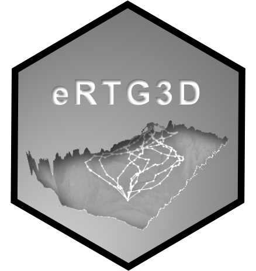

# eRTG3D 
<!-- badges: start -->
[](https://CRAN.R-project.org/package=eRTG3D)
[](https://CRAN.R-project.org/package=eRTG3D)
[](https://badge.fury.io/gh/munterfinger%2FeRTG3D)
[](https://travis-ci.org/munterfinger/eRTG3D)
[](https://codecov.io/gh/munterfinger/eRTG3D)
[](https://www.gnu.org/licenses/gpl-3.0)
<!-- badges: end -->
  
The **e**mpirically informed **R**andom **T**rajectory **G**enerator in three dimensions (eRTG3D)
is an algorithm to generate realistic random trajectories in a 3-D space
between two given fix points, so-called Conditional Empirical Random Walks. The trajectory generation is based on empirical distribution functions extracted from observed trajectories (training data) and thus reflects the geometrical movement characteristics of the mover. A digital elevation model (DEM), representing the Earth's surface, and a background layer of probabilities (e.g. food sources, uplift potential, waterbodies, etc.) can be used to influence the trajectories.

The eRTG3D algorithm was developed and implemented as an R package within the scope of a Master's thesis (Unterfinger, [2018](https://www.geo.uzh.ch/dam/jcr:6194e41e-055c-4635-9807-53c5a54a3be7/MasterThesis_Unterfinger_2018.pdf)) at the Department of Geography, University of Zurich. The development started from a 2-D version of the eRTG algorithm by Technitis et al. ([2016](https://doi.org/10.5167/uzh-130652)).

## Get started
``` r
# Install release version from CRAN
install.packages("eRTG3D")

# Install development version from GitHub
devtools::install_github("munterfinger/eRTG3D")
```

## Features
The **eRTG3D** package contains functions to:

* calculate **movement parameters of 3-D GPS tracking data**, turning angle, lift angle and step length
* **extract distributions** from movement parameters;
    1. **P probability** - The mover's behavior from its perspective
    2. **Q probability** - The pull towards the target
* simulate **Unconditional Empirical Random Walks (UERW)**
* simulate **Conditional Empirical Random Walks (CERW)**
* simulate conditional **gliding and soaring behavior** of birds between two given points
* **statistically test** the simulated tracks against the original input
* **visualize** tracks, simulations and distributions in 3-D and 2-D
* conduct a basic **point cloud analysis**; extract **3-D Utilization Distributions (UDs)** from observed or simulated tracking data by means of voxel counting
* project 3-D tracking data into different **Coordinate Reference Systems (CRSs)**
* export data to **sf package objects**; 'sf, data.frames'
* manipulate **extent of raster layers**

## References
Unterfinger M ([2018](https://www.geo.uzh.ch/dam/jcr:6194e41e-055c-4635-9807-53c5a54a3be7/MasterThesis_Unterfinger_2018.pdf)). 3-D Trajectory Simulation in Movement Ecology: Conditional Empirical Random Walk. Master's thesis, University of Zurich.

Technitis G, Weibel R, Kranstauber B, Safi K ([2016](https://doi.org/10.5167/uzh-130652)). “An algorithm for empirically informed random trajectory generation between two endpoints.” GIScience 2016: Ninth International Conference on Geographic Information Science, 9, online. doi: [10.5167/uzh-130652](https://doi.org/10.5167/uzh-130652).
