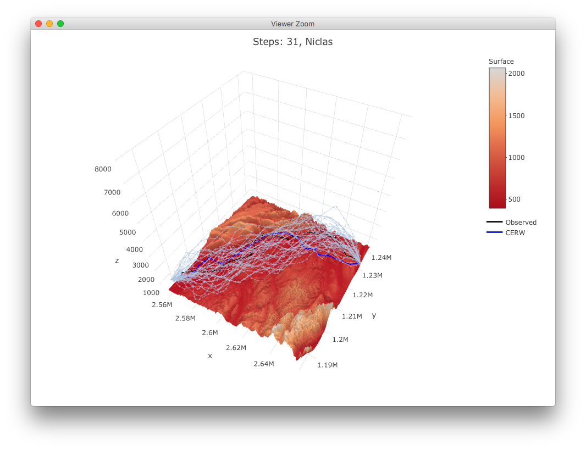

<style>
body {
text-align: justify}
</style>
```{r, echo = FALSE, eval=TRUE, include=FALSE}
knitr::opts_chunk$set(collapse = TRUE, comment = "#>")
options(knitr.table.format = "html", rmarkdown.html_vignette.check_title = FALSE)

library(eRTG3D)
library(ggplot2)
set.seed(1234)
cerwList <- reproduce.track.3d(n.sim = 5, niclas, DEM = dem)
# 
```

The trajectories can be plotted either in 2-D or in 3-D, using the `ggplot2` and `plotly` libraries. Additionally the densities of the track properties can be visualized.

```{r eval=FALSE}
cerwList <- reproduce.track.3d(n.sim = 5, niclas, DEM = dem)
```

## 2-D Plot
The `plot2d()` function takes either one or two arguments. The second argument can be a single track data.frame or list of track data.frames as for example the output of `n.sim.cons.3d()`. Also a DEM rasterLayer can be passed to the function.

```{r eval=TRUE, fig.align="center"}
plot2d(niclas, cerwList, DEM=dem,
       titleText=paste("Steps: ", nrow(niclas), ", Niclas", sep=""))
```

## 3-D Plot
```{r eval=TRUE, echo=FALSE, fig.align="center"}
#p <- plot3d(crws)
#htmltools::tags$img(p, timesHeight=1)
```

The `plot3d()` function takes either one or two arguments. The second argument can be a single track data.frame or list of track data.frames as for example the output of `n.sim.cons.3d()`. Also a DEM rasterLayer, which is plotted as a surface can be passed to the function.

```{r eval=FALSE}
plot3d(niclas, cerwList, DEM=dem,
       titleText=paste("Steps: ", nrow(niclas), ", Niclas", sep=""))
```

## Densities of turn angle, lift angle and step length of tracks
The function takes either one or two tracks. The second track can be a list of tracks as for example the output of `n.sim.cons.3d()`. In this case the densities of turn angle, lift angle and step length of all the simulations is taken. Additionally the `autodifferences` parameter can be set to `TRUE`, then the densities of the auto differences in turn angle, lift angle and step length are visualized.

```{r eval=TRUE, fig.align="center"}
plot3d.densities(niclas, cerwList)
```
